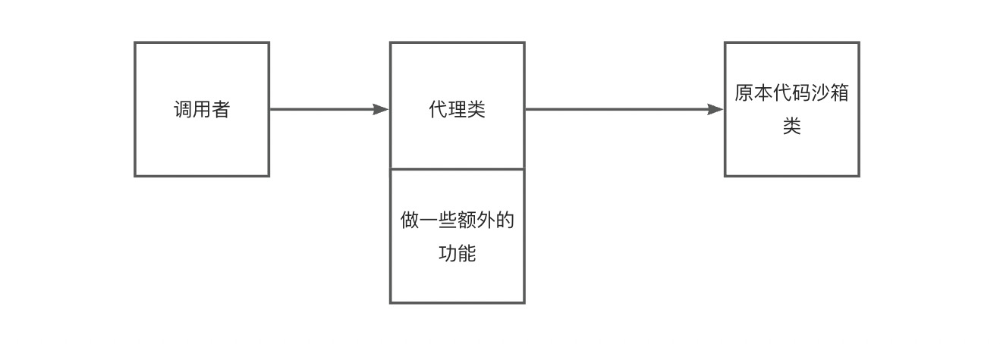

# 系统功能梳理

- 题目模块
  - 创建题目
  - 删除题目
  - 修改题目
  - 搜索题目
  - 在线做题

- 判题信息枚举
  - Accepted 成功
  - Wrong Answer 答案错误
  - Compile Error 编译错误
  - Memory Limit Exceeded 超时
  - Presentation Error 展示错误
  - Output Limit Exceeded 输出溢出
  - Waiting 等待中
  - Dangerous Operation 危险操作
  - Runtime Error 运行错误（用户程序问题）
  - System Error 系统错误 （做系统人的问题）

  
## 判题机模块

调用代码沙箱，把代码和输入交给代码沙箱去执行

代码沙箱：只负责接受代码和输入，返回编译运行的结果。不负责判题

完全解耦。大概流程如下 👇

代码沙箱接收和输出一组运行用例

如果每个用例单独调用一次代码沙箱，会调用多次接口、需要多次网络传输
程序要多次编译、记录程序的执行状态

- 示例代码沙箱
- 远程代码沙箱
- 第三方代码沙箱:调用网上现成的

### 工厂模式

根据用户传入的字符串（沙箱类别），来生成对应的代码沙箱实现类
此处使用静态工厂模式，实现比较简单

如果代码沙箱示例不会出现线程安全问题、可复用。

## 代码沙箱增强 - 代理模式

在调用代码沙箱前，输出请求参数日志
在调用代码沙箱后，输出响应结果日志

使用代理模式，提供一个Proxy,增强代码沙箱能力
解决了需要用户自己去调用多次
- 实现被代理的接口
- 通过构造函数接受一个被代理的接口实现类
- 调用被代理的接口实现类，在调用前后增加对应的操作

