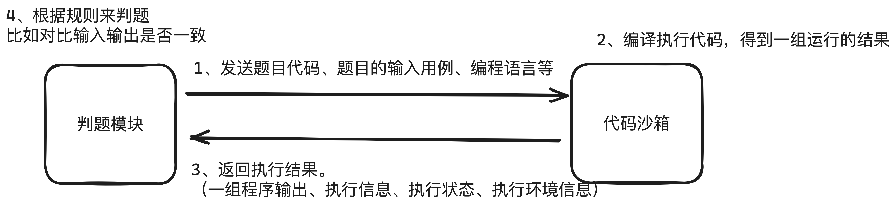
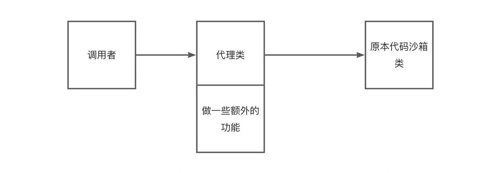

 

# pointoj-backend

## 🔫 技术选型
Java SpringBoot

## 🎯 系统功能梳理
- 题目模块
    - 创建题目
    - 删除题目
    - 修改题目
    - 搜索题目
    - 在线做题

- 判题信息枚举
    - Accepted 成功
    - Wrong Answer 答案错误
    - Compile Error 编译错误
    - Memory Limit Exceeded 超时
    - Presentation Error 展示错误
    - Output Limit Exceeded 输出溢出
    - Waiting 等待中
    - Dangerous Operation 危险操作
    - Runtime Error 运行错误（用户程序问题）
    - System Error 系统错误 （做系统人的问题）

## 📦 代码沙箱 和  🤖 判题机

调用代码沙箱，把代码和输入交给代码沙箱去执行
代码沙箱：只负责接受代码和输入，返回编译运行的结果。不负责判题
完全解耦。大概流程如下 👇

代码沙箱接收和输出一组运行用例

如果每个用例单独调用一次代码沙箱，会调用多次接口、需要多次网络传输
程序要多次编译、记录程序的执行状态

- 示例代码沙箱
- 远程代码沙箱
- 第三方代码沙箱（调用网上现成的）

### 工厂模式

根据用户传入的字符串（沙箱类别），来生成对应的代码沙箱实现类
此处使用静态工厂模式，实现比较简单

如果代码沙箱示例不会出现线程安全问题、可复用。

### 代码沙箱增强 - 代理模式

在调用代码沙箱前，输出请求参数日志
在调用代码沙箱后，输出响应结果日志

使用代理模式，提供一个Proxy,增强代码沙箱能力
解决了需要用户自己去调用多次
- 实现被代理的接口
- 通过构造函数接受一个被代理的接口实现类
- 调用被代理的接口实现类，在调用前后增加对应的操作

## 👾 判题服务
- 传入题目提交ID 获取对应的题目、提交信息（包含代码、编程语言）
- 如果题目提交状态不在等待中，就不重复执行了
- 更改（题目提交）状态为“判题中”，防止重复执行，也能让用户即时看到状态
- 调用沙箱，获取执行结果
- 再根据沙箱的执行结果，设置题目的判题状态和信息

### 判题逻辑
- 先判断沙箱执行的结果 输出数量是否 和 预期输出数量相等
- 依次判断每一项输出和预期输出是否相等
- 判题题目的限制是否符合要求
- 可能还有其他异常情况

### 策略模式
判题策略可能有多种。
比如：我们的代码沙箱本身执行程序要消耗时候，这个时间可能不同的编程语言是不同的。
比如：沙箱执行Java要额外花10s

采用策略模式。根据不同的情况，定义独立的策略。便于分别修改策略和维护。
而不是把所有的判题逻辑、if..else..代码全部混在一起写

- 定义判题策略接口，让代码更加通用
- 定义判题上下文对象，用于定义在策略中传递的参数
- 实现默认判题策略
- 新增一种判题策略，通过if..else..方式选择用哪种策略 
  - but 如果选择某种判题策略的过程比较复杂，如果都在调用判题服务的代码中，代码会越来越复杂
  大量的if else恶心死人。 这里单独编写一个判题策略的类
- 定义JudgeManager 目的简化对判题功能的调用。让调用方写最少的代码、调用最简单。 对于判题策略的选取，也在定义JudgeManager里处理

